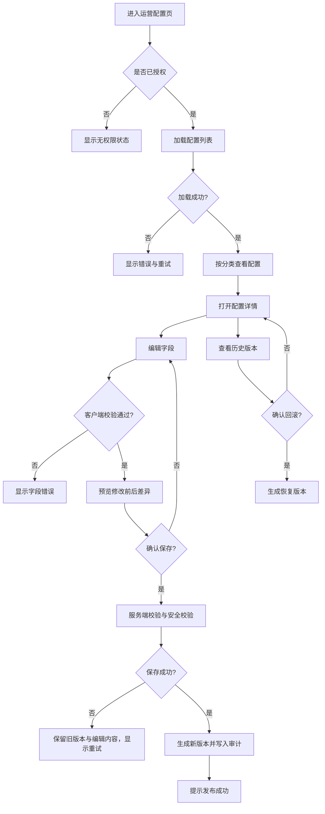

# 农间诊 P0-11 运营配置页产品需求

版本：`0.1.0`  
状态：可开发  
负责人：产品负责人  
适用角色：运营、农艺专家、AI/诊断工程师、前端、后端、QA

## 1. 目标与边界

运营人员可以在不发版的情况下调整诊断相关的展示文案、行动建议和安全提示，并让新的已发布配置在后续诊断结果中生效。

本轮只解决配置的查看、编辑、预览、发布、版本记录和回滚。配置页不直接修改模型权重，也不允许绕过 AI 安全规则。

本轮明确不包含：

- 天气服务和环境数据
- 农资商城、支付和分佣
- 专家实时聊天
- 微信订阅消息模板管理
- 模型训练、模型权重和向量库编辑
- 用户、农场和地块数据编辑

## 2. 用户故事

### 2.1 运营人员调整文案

作为运营人员，我希望修改风险等级、处理建议和安全提示，这样季节变化或运营策略调整时不需要等待小程序发版。

验收标准：

1. 运营人员可以查看全部配置项、当前状态、版本和最后修改时间。
2. 运营人员可以编辑允许编辑的字段，并在保存前预览修改前后的差异。
3. 发布后的配置只影响新生成的诊断结果，历史诊断保留当时的配置版本。
4. 保存失败时，上一版配置继续可用，页面保留用户正在编辑的内容。
5. 每次保存都会产生新版本，并记录修改人、修改时间和 requestId。

### 2.2 农艺专家审核安全边界

作为农艺专家，我希望明确哪些建议可以直接展示、哪些情况必须阻断或升级复核，避免运营文案造成错误用药或错误处置。

验收标准：

1. 涉及药剂、禁限用农药、固定剂量和安全间隔期的内容默认不能直接发布。
2. 高风险和检疫性问题必须配置专家复核文案和升级动作。
3. 缺少必填安全字段时，保存接口返回校验错误。
4. 配置页不能修改模型的安全拦截结果。

## 3. 配置对象公共字段

所有配置项都使用以下公共字段。字段名称是 API、Mock、前端和数据库的统一名称。

| 字段 | 类型 | 必填 | 规则 |
| --- | --- | --- | --- |
| `key` | string | 是 | 全局唯一，使用小写点号命名，例如 `risk.medium` |
| `category` | enum | 是 | `RISK`、`ACTION`、`IMAGE_QUALITY`、`SAFETY`、`EXPERT_REVIEW`、`HOME` |
| `status` | enum | 是 | `DRAFT` 或 `PUBLISHED` |
| `version` | string | 是 | 格式为 `v数字`，发布后递增 |
| `locale` | string | 是 | 首版固定为 `zh-CN` |
| `sortOrder` | number | 是 | 同一分类内的展示顺序，从 `1` 开始 |
| `content` | object | 是 | 根据 `category` 使用对应结构 |
| `updatedAt` | ISO 8601 string | 是 | 服务端生成，不允许前端传入 |
| `updatedBy` | string | 是 | 服务端从当前账号生成，不允许前端伪造 |
| `requestId` | string | 是 | 保存和回滚时由服务端生成 |

公共校验：`key` 长度 1–80；文本字段去除首尾空格；所有面向用户的正文不超过 500 个汉字；不得包含绝对化诊断或未经审核的药剂剂量。

## 4. 配置字段与首批配置

### 4.1 风险等级 `RISK`

风险配置描述结果页的等级名称、解释和处理时限。风险等级仍由诊断规则返回，运营配置只负责展示和经过白名单校验的行动窗口。

| `key` | `content` 必填字段 | 首批内容 |
| --- | --- | --- |
| `risk.low` | `level`、`label`、`description`、`actionWindow` | 低风险；暂未发现需要立即处置的明显信号；先按建议观察；`7天内复查` |
| `risk.medium` | 同上 | 中风险；可能影响叶片、果实或长势；先处理可执行事项并记录变化；`24小时内复查` |
| `risk.high` | 同上 | 高风险；存在较快扩散、较大损失或判断混淆可能；先隔离标记并尽快复核；`当天处理并复核` |
| `risk.critical` | 同上 | 极高风险；可能涉及检疫、整批损失或人员安全；停止可能扩大风险的操作并联系当地农技或植保部门；`立即升级` |

`content` 结构：

```json
{
  "level": "MEDIUM",
  "label": "中风险",
  "description": "可能影响叶片、果实或长势。",
  "actionWindow": "24小时内复查",
  "marker": "warning"
}
```

`level` 只能是 `LOW`、`MEDIUM`、`HIGH`、`CRITICAL`；`marker` 只能是 `success`、`warning`、`danger`、`critical`。颜色只作为辅助，页面必须同时展示文字。

### 4.2 处理建议 `ACTION`

处理建议必须落到用户下一步行动，不允许只写知识解释。

| `key` | 类型 | 首批内容 |
| --- | --- | --- |
| `action.do_now` | `DO_NOW` | 现在做；隔离并标记异常植株，避免在潮湿时修剪；今天完成 |
| `action.observe` | `OBSERVE` | 继续观察；按同一角度拍照，记录病斑大小、颜色和扩散方向；24小时内复查 |
| `action.avoid` | `AVOID` | 暂时不要做；不要自行混配、加量或缩短安全间隔期；确认登记和标签前暂停用药 |
| `action.expert_review` | `EXPERT_REVIEW` | 请专家复核；补拍叶片正反面并联系当地农技人员；高风险或低置信度时触发 |

`content` 结构：

```json
{
  "type": "DO_NOW",
  "title": "隔离并标记异常植株",
  "description": "避免在潮湿时修剪，并记录病斑变化。",
  "dueRule": "TODAY",
  "safetyLevel": "SAFE_NON_CHEMICAL",
  "taskDefault": true
}
```

`dueRule` 只能是 `NOW`、`TODAY`、`WITHIN_24H`、`WITHIN_7D`、`AFTER_EXPERT_REVIEW`；`safetyLevel` 只能是 `SAFE_NON_CHEMICAL`、`REVIEW_REQUIRED`、`BLOCKED`。

### 4.3 图片质量提示 `IMAGE_QUALITY`

图片质量配置只负责提示和用户决策，不代替服务端图像质量检测。

| `key` | `issueCode` | `allowContinue` | 首批用户提示 |
| --- | --- | --- | --- |
| `image_quality.too_small` | `IMAGE_TOO_SMALL` | `false` | 图片尺寸偏小，请靠近异常部位重新拍摄。 |
| `image_quality.blurry` | `IMAGE_BLURRY` | `false` | 画面可能不够清晰，请保持手机稳定并重新拍摄。 |
| `image_quality.too_dark` | `IMAGE_TOO_DARK` | `true` | 画面偏暗，建议移到自然光下重新拍摄；也可以继续提交。 |
| `image_quality.too_bright` | `IMAGE_TOO_BRIGHT` | `true` | 画面反光或过亮，建议避开直射光后重新拍摄。 |
| `image_quality.subject_small` | `SUBJECT_TOO_SMALL` | `false` | 异常部位占画面太小，请靠近病斑并保留少量健康组织。 |
| `image_quality.occluded` | `SUBJECT_OCCLUDED` | `false` | 异常部位被遮挡，请移开手指、叶片或杂物后重新拍摄。 |
| `image_quality.signal_invalid` | `QUALITY_SIGNAL_INVALID` | `true` | 暂时无法完整检查图片质量，可以重新选择或继续提交服务端检查。 |

`content` 结构：

```json
{
  "issueCode": "IMAGE_TOO_DARK",
  "title": "画面偏暗",
  "message": "建议移到自然光下重新拍摄；也可以继续提交。",
  "allowContinue": true,
  "severity": "WARNING",
  "primaryAction": "RETAKE_PHOTO",
  "secondaryAction": "CONTINUE_SUBMIT"
}
```

`severity` 只能是 `INFO`、`WARNING`、`BLOCKED`；`primaryAction` 只能是 `RETAKE_PHOTO`、`OPEN_SETTINGS`、`CONTINUE_SUBMIT`；阻断项的 `allowContinue` 必须为 `false`。

### 4.4 安全提醒 `SAFETY`

安全配置是发布门槛，不能被普通运营账号绕过。

| `key` | `ruleCode` | `blockAction` | 首批安全提醒 |
| --- | --- | --- | --- |
| `safety.uncertain-pesticide` | `UNVERIFIED_PESTICIDE` | `true` | 结果不足以支持具体用药，请先查询有效登记和产品标签，或咨询当地农技人员。 |
| `safety.mixed-pesticide` | `MIXED_PESTICIDE` | `true` | 不要根据图片自行混配或加量，先让当地农技人员确认。 |
| `safety.preharvest-interval` | `PREHARVEST_INTERVAL_UNKNOWN` | `true` | 未核实安全间隔期前，不要据此安排采收。 |
| `safety.quarantine-risk` | `QUARANTINE_RISK` | `true` | 可能涉及检疫风险，请标记植株并联系当地植保或农技部门复核。 |
| `safety.human-exposure` | `HUMAN_EXPOSURE` | `true` | 如有人或牲畜接触农药后不适，请优先联系当地医疗或专业机构。 |

`content` 结构：

```json
{
  "ruleCode": "UNVERIFIED_PESTICIDE",
  "title": "暂不建议自行用药",
  "message": "结果不足以支持具体用药，请先查询有效登记和产品标签，或咨询当地农技人员。",
  "blockAction": true,
  "requiredEscalation": "LOCAL_AGRONOMIST",
  "allowDose": false
}
```

`allowDose` 首版固定为 `false`，不能在运营配置页改为 `true`；涉及具体剂量、产品和安全间隔期的内容必须经过独立安全规则和标签核验。

### 4.5 专家复核触发文案 `EXPERT_REVIEW`

专家复核配置只描述触发条件和用户下一步，不实现专家聊天。

| `key` | `triggerCode` | 首批触发条件 |
| --- | --- | --- |
| `expert_review.low-confidence` | `LOW_CONFIDENCE` | 置信度低于 `0.65` 或主要问题无法区分 |
| `expert_review.high-risk` | `HIGH_RISK` | 风险为 `HIGH` 或 `CRITICAL` |
| `expert_review.quarantine` | `QUARANTINE_SUSPECTED` | 命中检疫性问题或快速扩散规则 |
| `expert_review.no-improvement` | `NO_IMPROVEMENT` | 执行任务后复查无改善或更严重 |

`content` 结构：

```json
{
  "triggerCode": "LOW_CONFIDENCE",
  "title": "建议农技人员复核",
  "message": "当前图片和症状仍有混淆可能，请补拍并结合田间情况确认。",
  "actionLabel": "补拍并提交复核",
  "estimatedResponse": "预计 1 个工作日内给出处理建议",
  "required": true
}
```

### 4.6 首页提示 `HOME`

| `key` | 必填字段 | 首批内容 |
| --- | --- | --- |
| `home.quick-start` | `title`、`description`、`badge` | 拍下作物异常部位；靠近病斑，保持光线均匀，拍清叶片边缘；约 30 秒得到初步判断 |
| `home.disclaimer` | `title`、`description` | 辅助判断；结果需要结合田间情况确认，不代替农技人员诊断。 |

## 5. 配置状态与权限

| 操作 | 运营账号 | 农艺专家账号 | 管理员账号 |
| --- | --- | --- | --- |
| 查看已发布配置 | 是 | 是 | 是 |
| 编辑风险、行动和首页文案 | 是 | 是 | 是 |
| 编辑安全规则 | 否 | 是 | 是 |
| 发布普通文案 | 是 | 是 | 是 |
| 发布安全规则 | 否 | 是 | 是 |
| 回滚普通配置 | 是 | 是 | 是 |
| 回滚安全配置 | 否 | 是 | 是 |
| 修改 `allowDose` | 否 | 否 | 否 |
| 修改模型阈值 | 否 | 否 | 否 |

首版 Mock 可以使用固定测试账号，但权限判断、发布、回滚和审计字段必须在 API 结构中真实存在。

## 6. 页面流程图



## 7. Mock 与真实实现边界

| 能力 | 首版实现 | 必须真实的边界 |
| --- | --- | --- |
| 配置列表和详情 | 可以 Mock 初始数据 | 字段结构、状态、版本和权限 |
| 配置编辑 | 可以 Mock 保存过程 | 校验规则和失败恢复行为 |
| 配置发布 | 可以 Mock 账号 | 发布状态、版本递增和审计字段 |
| 配置回滚 | 可以 Mock 历史版本 | 回滚生成新版本，不能覆盖或删除审计记录 |
| 风险等级展示 | 可以使用 Mock 诊断结果 | 风险枚举、文字和标记映射 |
| 处理建议展示 | 可以使用 Mock AI 结果 | 建议类型、安全等级和任务字段 |
| 图片质量提示 | 客户端可先 Mock 复杂检测 | `issueCode`、阻断/继续决策和用户操作 |
| 安全校验 | 规则可先使用本地固定数据 | 禁止绕过、禁止输出未经核验剂量 |
| 专家复核 | 触发状态可 Mock | 触发原因、升级动作和结果记录 |
| 模型推理 | 可以 Mock | 结果必须标记辅助判断，并保留模型版本 |

## 8. API 契约

### 8.1 接口

```text
GET  /api/v1/ops/configs
GET  /api/v1/ops/configs/{key}
POST /api/v1/ops/configs/{key}/preview
PUT  /api/v1/ops/configs/{key}
GET  /api/v1/ops/configs/{key}/versions
POST /api/v1/ops/configs/{key}/rollback
```

### 8.2 保存请求

```json
{
  "expectedVersion": "v1.4",
  "content": {
    "level": "MEDIUM",
    "label": "中风险",
    "description": "可能影响叶片、果实或长势。",
    "actionWindow": "24小时内复查",
    "marker": "warning"
  },
  "publish": true
}
```

`expectedVersion` 必须匹配服务端当前版本，不匹配时返回 `CONFIG_VERSION_CONFLICT`，防止两个人互相覆盖。

### 8.3 统一错误码

| 错误码 | 含义 | 页面动作 |
| --- | --- | --- |
| `OPS_CONFIG_FORBIDDEN` | 无权限 | 显示无权限，不重试保存 |
| `OPS_CONFIG_NOT_FOUND` | 配置不存在 | 返回列表并提示刷新 |
| `OPS_CONFIG_VALIDATION_FAILED` | 字段或文案不合法 | 定位到具体字段 |
| `OPS_CONFIG_SAFETY_BLOCKED` | 命中安全规则 | 显示安全原因，禁止发布 |
| `CONFIG_VERSION_CONFLICT` | 版本已被别人更新 | 重新加载并保留当前编辑内容 |
| `OPS_CONFIG_STORAGE_ERROR` | 配置存储失败 | 保留旧版本，提供重试 |

## 9. P0-11 验收标准

### 功能验收

1. 运营账号可以查看六类配置：风险、行动、图片质量、安全、专家复核、首页提示。
2. 每类配置至少有一个可编辑示例，字段和枚举完整。
3. 编辑普通配置后可以预览差异、保存并生成新版本。
4. 编辑安全配置时，缺少 `ruleCode`、`blockAction` 或 `requiredEscalation` 不能保存。
5. 保存失败时，旧版本继续可读，编辑中的新内容不丢失。
6. 可以查看历史版本并回滚；回滚会生成新版本，不删除历史记录。
7. 诊断结果页读取已发布配置，历史诊断仍显示原配置版本。
8. 未授权账号不能查看或修改配置。
9. 配置版本冲突时不能覆盖他人的更新。
10. 配置服务异常时，诊断结果页使用经过审核的默认配置，不出现空白或未定义文案。

### 安全验收

1. 任何配置不能把 `allowDose` 改为 `true`。
2. 任何配置不能把 `blockAction` 从 `true` 改为 `false`，除非由农艺专家或管理员按照权限发布，并通过安全校验。
3. 不允许保存“确诊”“保证治愈”“自行加量”等绝对或危险文案。
4. 高风险、检疫风险、低置信度和复查恶化必须有复核路径。
5. 所有诊断结果保留 `configVersion`，可追溯到产生结果时使用的配置版本。

### 体验验收

1. 375px 宽度下表单、按钮和错误提示不溢出。
2. 微信大字体下长文案可换行，主要操作可见且可点击。
3. 保存、回滚、失败和版本冲突都有明确的页面内反馈。
4. 触控目标不小于 88rpx。
5. 页面不会用颜色单独表达风险或状态。

## 10. 开发拆分

| 任务 | 主负责人 | 协作人 | 交付物 |
| --- | --- | --- | --- |
| 字段和枚举冻结 | 产品负责人 | AI、农艺专家、后端 | 本文档、字段表 |
| 首批文案 | 提取文字 | 内容负责人、农艺专家 | 配置 JSON |
| Figma 和状态设计 | UI/UX 设计师 | 前端、产品负责人 | 配置页设计稿 |
| 规则和安全校验 | AI/诊断工程师 | 农艺专家、后端 | 校验规则和测试样例 |
| API 和数据库 | 后端 | 问题解决、QA | API、迁移、权限和审计 |
| 小程序页面 | 前端 | UI/UX、后端 | 页面、Mock、真实 API 接入 |
| 回归和发布 | QA/发布负责人 | 全员 | 测试报告、构建产物、发布结论 |

## 11. 完成定义

P0-11 只有同时满足以下条件才算完成：

- 本文档中的字段和枚举已经冻结。
- 首批配置内容已由农艺专家审核。
- Mock API 和真实 API 使用同一份契约。
- 前端、后端、AI 和内容负责人都有可执行的输入。
- 配置保存、发布、回滚、权限和版本冲突均有自动化测试。
- 微信开发者工具完成正常、失败、无权限、长文案和大字号验收。
- QA 给出“通过”或产品负责人书面接受的“有条件通过”。
