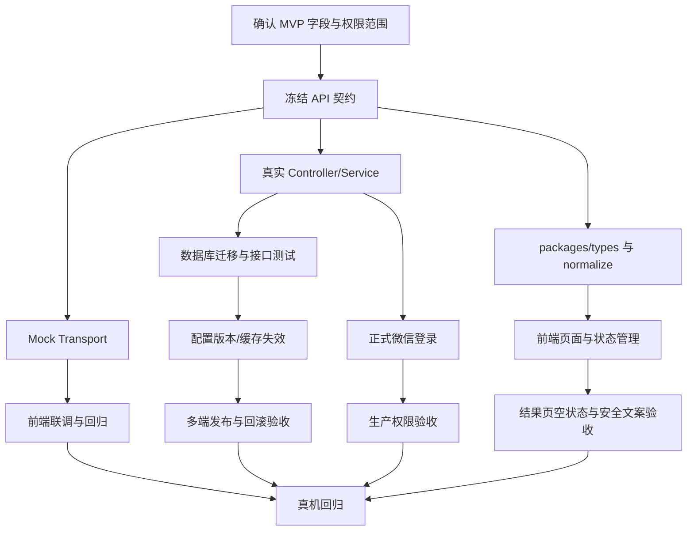

# 农间诊技术方案与跨角色阻塞处理

更新时间：2026-09-29  
负责人：技术方案负责人（本文件）

## 1. 当前结论

前端、Mock 和主要后端业务接口已经通过 `packages/api-client` 形成统一适配层，诊断、农场、地块、任务、消息、文件、认证和运营配置的基础字段可以在 Mock/Real 两种传输实现之间切换。运营配置的 Controller、Service、Prisma 模型、Client 和 Mock 已补齐，当前剩余工作集中在真实数据库迁移、发布后的缓存失效和真机联调验收。

因此当前版本可以继续做 UI、Mock 和运营配置接口联调；正式微信登录、配置跨设备缓存同步和真机回归前，必须先关闭本文档中的 P0/P1 阻塞。

## 2. 分层架构

```text
微信小程序页面
  -> domain hooks / store
  -> src/services/*.api.ts
  -> packages/api-client（请求 DTO、响应 DTO、normalize 适配）
  -> ApiTransport
       ├─ mockTransport（本地可重复测试数据）
       └─ taroTransport（真实 HTTP、JWT、错误归一化）
  -> API Gateway / BFF
       ├─ auth-service       微信登录、JWT、会话撤销
       ├─ farm-service       农场、地块、作物档案
       ├─ diagnosis-service  诊断任务、状态机、幂等
       ├─ ai-orchestrator    Shennong AI、Prompt/知识版本、审计
       ├─ task-service        农事任务、负责人、提醒
       ├─ notification-service 消息、未读、偏好
       ├─ media-service       上传凭证、文件归属、病毒/格式校验
       └─ ops-config-service  运营配置、版本、发布、回滚
  -> PostgreSQL / Object Storage / Queue
```

现有 NestJS 后端可以先按模块化单体运行，再按上面的边界拆分微服务。拆分前必须保持 `/api/v1` 契约不变，服务间通过事件传递诊断完成、任务到期和配置发布事件，避免页面直接依赖内部服务。

## 3. 字段治理规则

1. 服务端 DTO 使用数据库/API 语义（例如 `region`、小写状态）；前端稳定模型使用页面语义（例如 `location`、大写状态）。所有转换只允许出现在 `packages/api-client/src/index.ts`，页面禁止自行转换。
2. 新字段必须同时更新 `packages/types`、API Client、Mock、后端 DTO、接口文档和至少一个契约测试。
3. 可选字段的含义必须写清楚：缺失表示“未知”，空数组表示“已确认没有数据”，不能让结果页用 `undefined` 猜测业务状态。
4. 诊断结果必须始终返回可渲染的 `disclaimer`、`model`、`requestId`；`possibleIssues` 和 `actions` 可以为空，但页面必须展示安全空状态。

## 3.1 硬编码检查结果

`src/config/env.ts` 中的 `API_MODE`、`API_BASE_URL`、`AUTH_TOKEN_STORAGE_KEY` 和订阅模板 ID 属于构建/环境配置，可以保留。页面中的风险文案、首页引导、诊断行动文案已经有运营配置和默认值两级来源，但 `src/pages/home/index.tsx`、`src/pages/diagnosis/index.tsx`、`src/pages/diagnosis-result/index.tsx` 仍有少量展示兜底文案；后续应统一收敛到 domain adapter。后端 `shennong-ai-provider.ts` 中的 Prompt 和安全规则属于版本化的 AI 策略，当前由 AI/农业负责人维护，必须把版本写入诊断元数据，不能由小程序端覆盖。

## 4. Mock/Real 替换方案

当前统一入口是 `new ApiClient(API_MODE === 'mock' ? mockTransport : taroTransport)`。运营配置也已接入同一 Transport 契约，调用链如下：

```text
页面 -> opsConfigApi -> OpsConfigClient -> ApiTransport
                         ├─ mockTransport：Storage + seed
                         └─ taroTransport：/api/v1/ops/configs
```

配置接口统一返回 `ApiEnvelope<T>`，其中 `T` 至少包含 `configKey`、`value`、`version`、`status`、`updatedAt`、`updatedBy`。Mock 与 Real 的方法名、请求体和错误码必须一致，页面不得判断 `API_MODE`。

保存流程：服务端校验 schema 和权限，写入新版本，返回最新配置；前端清除 `ops-config:{configKey}`，更新当前页面 state，再按返回的 `version` 重新读取。当前需要补齐发布事件和页面级失效通知。回滚流程已创建新的发布版本并保留历史版本；多端同步仍需使用 `version`/`ETag` 做乐观锁，冲突返回 `CONFIG_VERSION_CONFLICT`。

## 5. 缓存、权限和结果页兜底

- 配置缓存按 `configKey + version` 缓存；发布和回滚事件使 BFF、页面 store 和本地 Storage 同时失效。
- 所有业务查询按 JWT `sub/userId` 做资源归属校验，不能接受客户端传入的 ownerId 作为权限依据。`mock-login` 仅在 `MOCK_LOGIN_ENABLED=true` 且非生产环境可用。
- HTTP 层统一处理 401：清理 token 和 identity，回到可恢复登录态；不能在单个页面重复实现。
- 结果页的默认文案、免责声明、模型占位和空列表由 domain adapter 提供；运营配置缺失时仍能显示诊断结果、风险说明和“联系农技员”入口，不允许出现白屏或只有空卡片。

## 6. 任务依赖图



## 7. 交付顺序与完成定义

先由产品确认 `assignee`、消息偏好和配置跨设备缓存是否进入当前版本；随后完成缓存失效、登录和结果页验收。完成定义是：Mock/Real 使用同一 Client 方法；契约测试覆盖成功、空值、401、403、409；配置保存后刷新和回滚在两台设备可见；结果页在配置缺失和 AI 返回空列表时仍可渲染。

